  

  

  

 
### &nbsp;About Me 

  

    I am <strong>Nayan</strong>, passionate about <strong>knowledge</strong> in all its forms - whether technology, nature, the universe, or life itself.
    My hobbies revolve around various forms of <strong>development</strong>, from building applications to crafting designs. Since childhood, I've been fascinated by understanding how things work, which naturally led me to enjoy <strong>designing</strong> solutions and getting hands-on with <strong>development</strong>.
  

  
  

    Currently, I work as a Software Engineer at FinTech solutions, where I'm thoroughly enjoying my exploration of the finance world through Java - discovering how beautifully Java integrates within this domain.
    I have a particular passion for <strong>web development</strong>, specializing in <strong>backend systems</strong> and full-stack applications using <strong>Spring Boot and React</strong>. As a full-stack developer, I bridge the gap between frontend elegance and backend robustness, creating seamless user experiences powered by solid architecture.
  

  
  

    I'm constantly eager to expand my technical horizons, learning new languages and technologies to achieve greater <strong>autonomy</strong> across the entire development lifecycle - from conception to deployment.
  

 
 

### 🛠 &nbsp;Tech Stack

 
 
 
 
 
 
 
 

### 📫 &nbsp; How to reach me:

 &nbsp;
 &nbsp;
